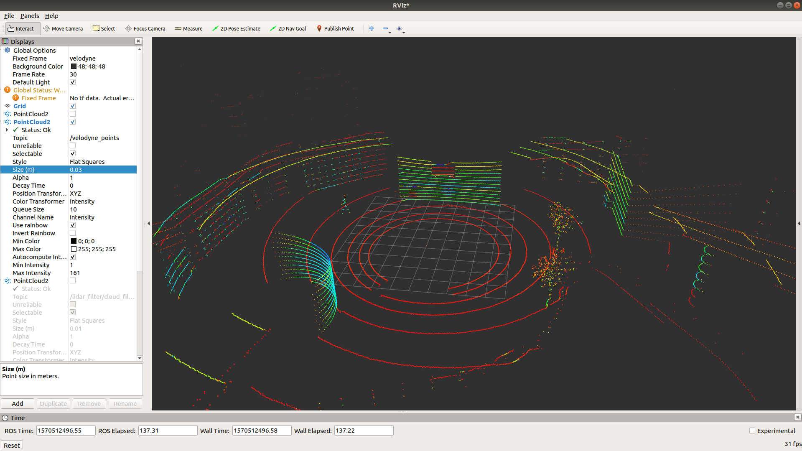

# lidar_distance_filter

 ### ROS velodyne lidat distance filtering package.
 
 ## Run
    roslaunch lidar_distance_filter lidar_distance_filter.launch
 
 ## Parameters
  Distance : filtering distance value.
  
 ## Result
 #### Velodyne Raw data

 #### Distance filtering data

